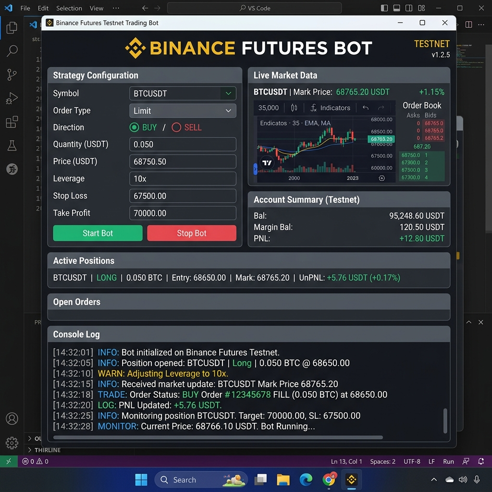

# Binance Futures Trading Bot

A sleek, dark-themed trading bot desktop application and CLI tool to interact with the Binance USDT-M Futures Testnet. It supports offline simulation/demo mode by default if credentials are not configured.



## Tech Stack

- **Language**: Python 3.8+
- **GUI Engine**: Tkinter (Standard Library)
- **HTTP Client**: Requests (Reuses TCP/TLS connections via Session pool)
- **Environment**: python-dotenv

## Steps to Run Directly

### 1. Install Dependencies
Navigate into the folder and install requirements:
```bash
pip install -r requirements.txt
```

### 2. Configure Credentials (Optional)
Copy `.env.example` to `.env` and enter your API credentials:
```bash
# Windows
copy .env.example .env
# macOS/Linux
cp .env.example .env
```
*Note: If credentials are left as placeholders or invalid, the bot automatically runs in **Offline Demo Mode** with simulated order responses.*

### 3. Run the GUI
Launch the desktop graphical user interface directly:
```bash
python -m trading_bot --gui
```

### 4. Run via CLI (Alternative)
You can also run commands directly from the command line:
- **Ping testnet**:
  ```bash
  python -m trading_bot --ping
  ```
- **Place MARKET Order**:
  ```bash
  python -m trading_bot --symbol BTCUSDT --side BUY --type MARKET --quantity 0.001
  ```
- **Place LIMIT Order**:
  ```bash
  python -m trading_bot --symbol BTCUSDT --side SELL --type LIMIT --quantity 0.001 --price 95000
  ```
